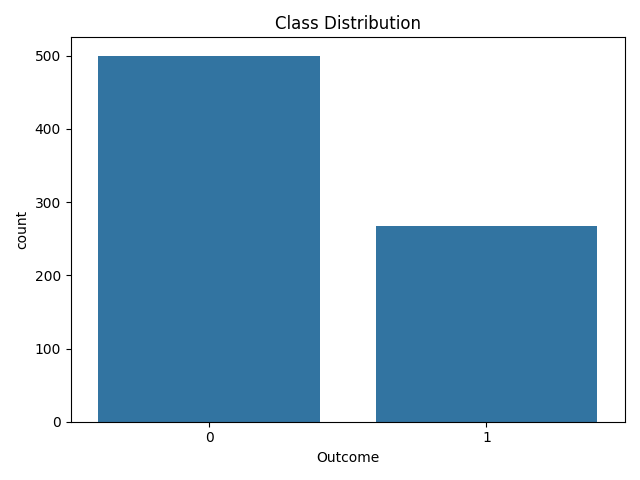
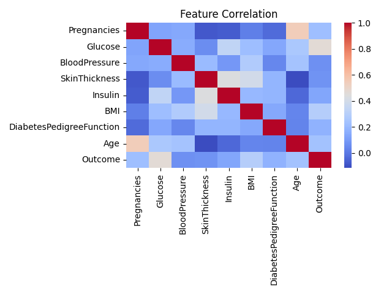

# Disease Risk Prediction using Patient Lifestyle

## 🎯 Problem Statement
The goal of this project is to predict the risk of diabetes using patient lifestyle and medical data.

## 📌 Objective
To build a machine learning model that can accurately classify whether a patient is diabetic or not.

## 📊 Dataset Features
| Feature Name | Description |
|-------------|------------|
| Pregnancies | Number of pregnancies |
| Glucose | Blood glucose level |
| BloodPressure | Blood pressure level |
| SkinThickness | Skin fold thickness |
| Insulin | Insulin level |
| BMI | Body Mass Index |
| DiabetesPedigreeFunction | Genetic likelihood |
| Age | Age of patient |
| Outcome | 0 = No Diabetes, 1 = Diabetes |

## ⚙️ Workflow
| Step | Description |
|------|------------|
| Data Understanding | Explored dataset |
| Preprocessing | Handled missing values |
| Feature Selection | Selected X and y |
| Train-Test Split | Split data (80/20) |
| Scaling | Applied StandardScaler |
| Model Building | Logistic Regression |
| Evaluation | Accuracy + Confusion Matrix |
| Model Saving | Saved using joblib |

## 📈 Results
| Model | Accuracy |
|------|----------|
| Logistic Regression | ~75% |

---

## 📊 Visualizations

### Class Distribution

### Correlation Heatmap

---

## ▶️ How to Run

1. Clone the repo:
git clone https://github.com/aishh48/Disease-Risk-Prediction.git

2. Install dependencies:
pip install -r requirements.txt

3. Run notebooks:
- data_understanding.ipynb
- preprocessing.ipynb
- model_building.ipynb

## 🧠 Key Insights
- Zero values represented missing data
- Preprocessing improved data quality
- Model performs better on non-diabetic cases

## 🚀 Future Improvements
- Improve accuracy using advanced models
- Add UI (Streamlit)
- Deploy as web app

## 👤 Author
Aishwarya
